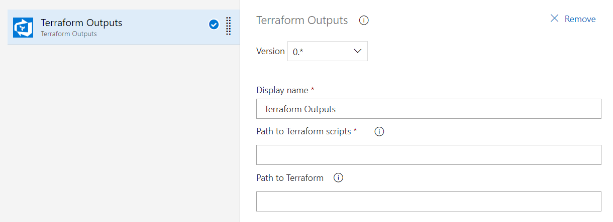

# Terraform-Outputs

This extension enables you to use the Terraform outputs as variables in your Azure Pipelines.

## Terraform Outputs Task

This task will execute 'terraform output -json' command within the provided "Path to Terraform scripts" and map all these values to pipeline variables.

Optionally a path to Terraform assembly can be provided. If it's available in PATH this value can be leave empty.

## CI Build pipeline

## CD Release pipeline
  
